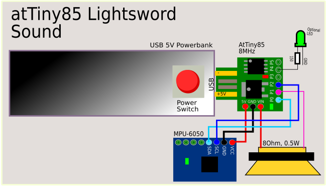
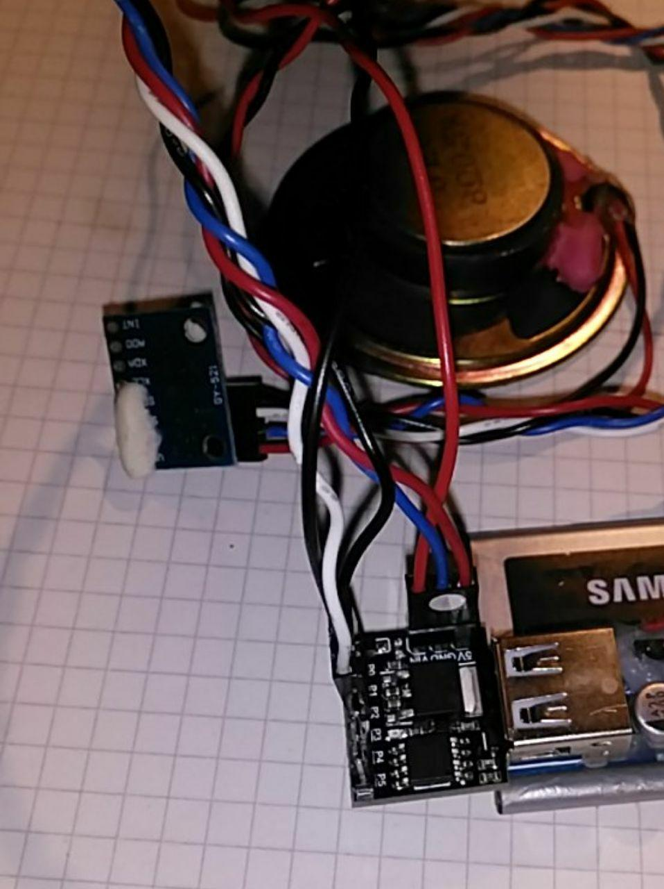

# Lightsword Sound

Use atTiny85 (8Mhz), PC speaker and i2c MPU-6050 gyroscope to build a
device with lightsword sounds. Because we do not use a sound chip
(we only use sawtooth wave) the sound is very different.

# Features

- switch on-sound
- sound changes on movement
- less work
- just a small part list

# Circuit

# Picture

